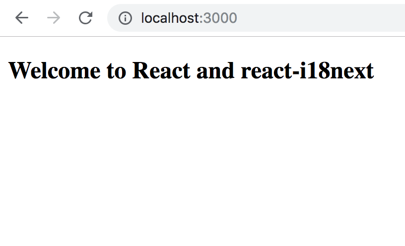

# Getting started

## Installation

### Install using npm

react-i18next can be added to your project using **npm**:

```bash
# npm
$ npm install react-i18next i18next --save
```

In the `/dist` folder you find specific builds for `commonjs`, `es6 modules`,...


The module is optimized to load by webpack, rollup, ... The correct entry points are already configured in the package.json. There should be no extra setup needed to get the best build option.


### Load from CDN

You can also add a script tag to load react-i18next from one of the CDNs providing it, eg.:

**unpkg.com**

* [https://unpkg.com/react-i18next/react-i18next.js](https://unpkg.com/react-i18next/react-i18next.js)
* [https://unpkg.com/react-i18next/react-i18next.min.js](https://unpkg.com/react-i18next/react-i18next.min.js)

## Translation "how to"


You should read the [i18next](https://www.i18next.com) documentation at some point as we do not repeat all the [configuration options](https://www.i18next.com/overview/configuration-options) and translation functionalities like [plurals](https://www.i18next.com/translation-function/plurals), [formatting](https://www.i18next.com/translation-function/formatting), [interpolation](https://www.i18next.com/translation-function/interpolation), ... here.


You got two options to translate your content:

### Simple content

Simple content can easily be translated using the provided `t` function.

**Before:**

```javascript
<div>Just simple content</div>
```

**After:**

```javascript
<div>{t('simpleContent')}</div>
```


You will get the t function by using the [useTranslation](latest/usetranslation-hook.md) hook or the [withTranslation](latest/withtranslation-hoc.md) hoc.


### JSX tree

Sometimes you might want to include html formatting or components like links into your translations. \(Always try to get the best result for your translators - the final string to translate should be a complete sentence\).

**Before:** Your react code would have looked something like:

```javascript
<div>
  Hello <strong title="this is your name">{name}</strong>, you have {count} unread message(s). <Link to="/msgs">Go to messages</Link>.
</div>
```

**After:** With the trans component just change it to:

```javascript
<Trans i18nKey="userMessagesUnread" count={count}>
  Hello <strong title={t('nameTitle')}>{{name}}</strong>, you have {{count}} unread message. <Link to="/msgs">Go to messages</Link>.
</Trans>
```


Learn more about the Trans Component [here](latest/trans-component.md) 


## Basic sample

This basic sample tries to add i18n in a one file sample.

```javascript
import React from "react";
import ReactDOM from "react-dom";
import i18n from "i18next";
import { useTranslation, initReactI18next } from "react-i18next";

i18n
  .use(initReactI18next) // passes i18n down to react-i18next
  .init({
    resources: {
      en: {
        translation: {
          "Welcome to React": "Welcome to React and react-i18next"
        }
      }
    },
    lng: "en",
    fallbackLng: "en",

    interpolation: {
      escapeValue: false
    }
  });

function App() {
  const { t } = useTranslation();

  return <h2>{t('Welcome to React')}</h2>;
}

// append app to dom
ReactDOM.render(
  <App />,
  document.getElementById("root")
);
```

#### RESULT:




This sample while very simple does come with some [drawbacks](guides/the-drawbacks-of-other-i18n-solutions.md) to getting the full potential from using react-i18next you should read the extended [step by step guide](latest/using-with-hooks.md).


### Do you like to read a more complete step by step tutorial?


[Here](https://dev.to/adrai/how-to-properly-internationalize-a-react-application-using-i18next-3hdb) you'll find a simple tutorial on how to best use react-i18next.  
Some basics of i18next and some cool possibilities on how to optimize your localization workflow.[  
 ](https://dev.to/adrai/how-to-properly-internationalize-a-react-application-using-i18next-3hdb)


