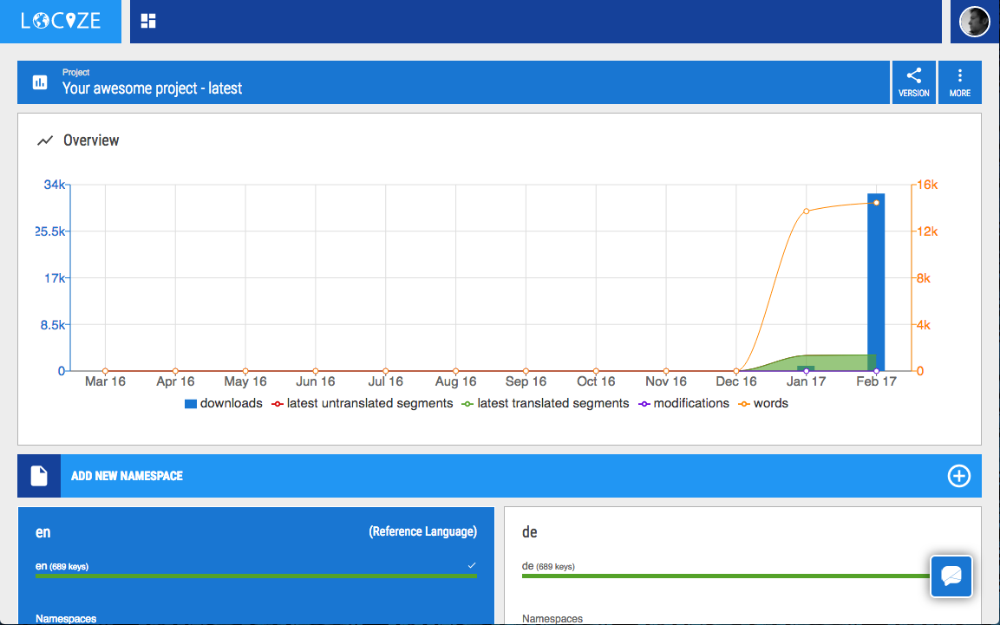

# Introduction

## What is react-i18next?

react-i18next is a powerful **internationalization** framework for **reactjs** / **reactnative** which is based on [i18next](http://i18next.com).


You should read the [i18next](https://www.i18next.com) documentation. The [configuration options](https://www.i18next.com/overview/configuration-options) and translation functionalities like [plurals](https://www.i18next.com/translation-function/plurals), [formatting](https://www.i18next.com/translation-function/formatting), [interpolation](https://www.i18next.com/translation-function/interpolation), ... are documented there.


The module provides multiple components eg. to assert that needed translations get loaded or that your content get newly rendered when the language changes.

react-i18next is optimally suited for **serverside rendering**. It provides extra extension point to eg. work with next.js. [Learn more](../misc/serverside-rendering.md).

As react-i18next depends on [i18next](http://i18next.com) you can use it on any other UI framework and serverside \(node.js, .net, ...\) too. Like the react philosophy - just:

> **Learn once - translate everywhere**.

## What does my code look like

**Before:** Your react code would have looked something like:

```markup
...
<div>Just simple content</div>
<div>
  Hello <strong title="this is your name">{name}</strong>, you have {count} unread message(s). <Link to="/msgs">Go to messages</Link>.
</div>
...
```

**After:** With the Trans component just change it to:

```markup
...
<div>{t('simpleContent')}</div>
<Trans i18nKey="userMessagesUnread" count={count}>
  Hello <strong title={t('nameTitle')}>{{name}}</strong>, you have {{count}} unread message. <Link to="/msgs">Go to messages</Link>.
</Trans>
...
```

If you prefer not using semantic keys but text - [that's also possible](https://www.i18next.com/principles/fallback.html#key-fallback).

## On top: Localization as a service

I18next provides with [locize.com](http://locize.com/?utm_source=react_i18next_com&utm_medium=gitbook) a own translation management tool.



[Learn more about the enterprise offering](https://www.i18next.com/for-enterprises.html)

